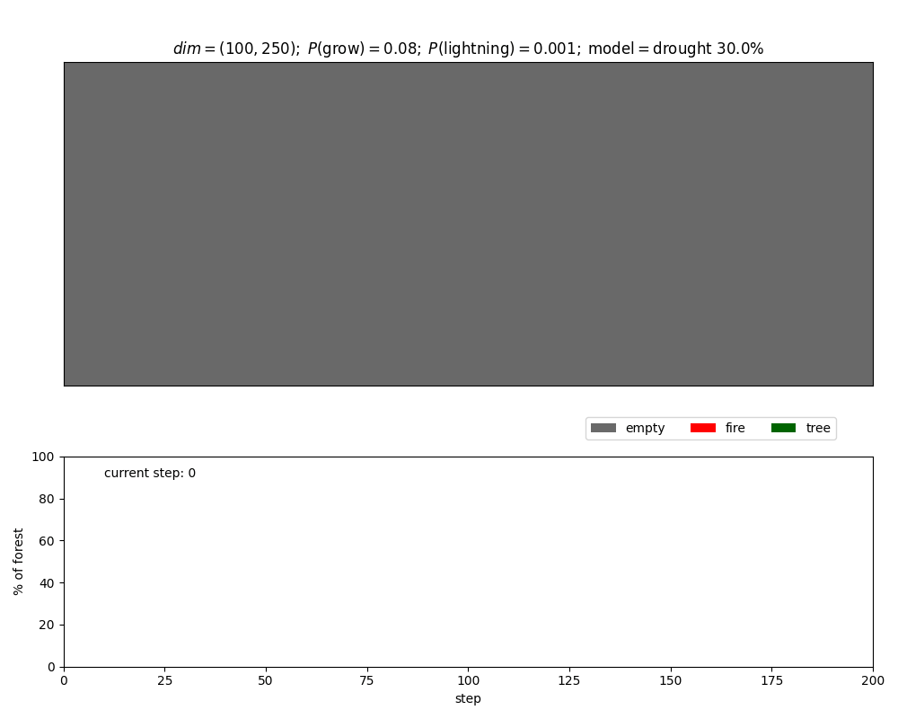
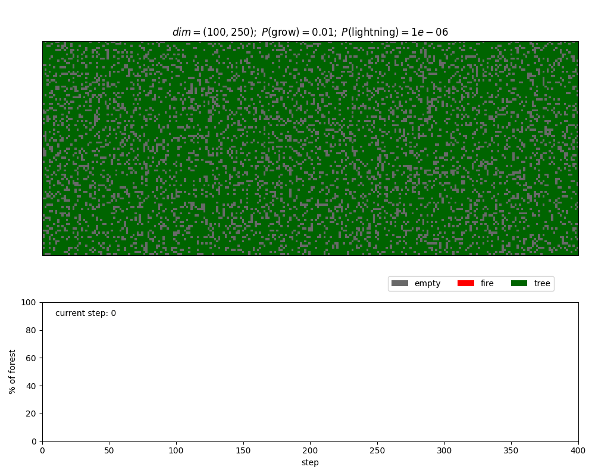

# Forest fire model 

I got the inspiration for this quick project from browsing [profConradi's](https://github.com/profConradi/Python_Simulations) great simulations.

This is a python implementation of an agent-based model simulating the spread of forest fires. 
The model is based on a cellular automaton approach, where the forest is represented as a grid of cells. 
Each cell can be in one of three states: empty, tree, or burning.
The simulation evolves in discrete time steps, with the following rules:

- A burning cell turns into an empty cell.
- A tree cell turns into a buring cell if it's neighbor(s) is(are) burning.
- An empty cell has a probability of growing a new tree.
- An tree cell has a (small) probability of starting to burn from a lightning strike.

This model extends the model by implementing a skew (droughtiness) parameter. Wheter a tree cell will catch fire is now determined by a likelihood due to the skew and how many of it's neigbors are burning.

### With the droughtiness parameter

### Simple model

